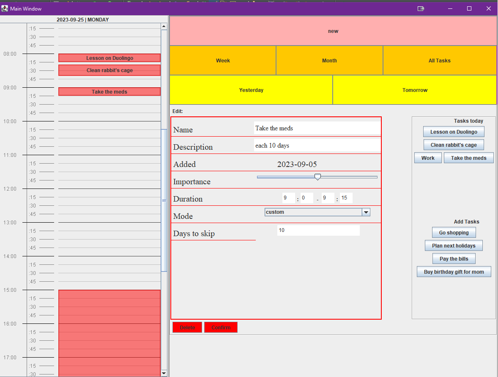
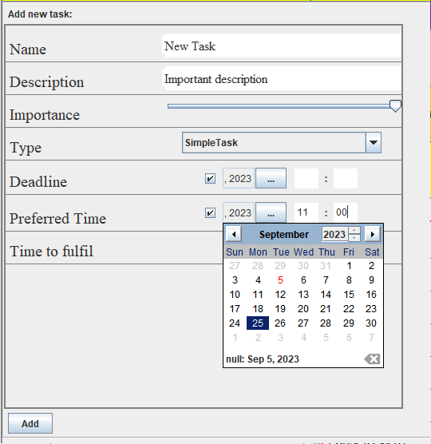
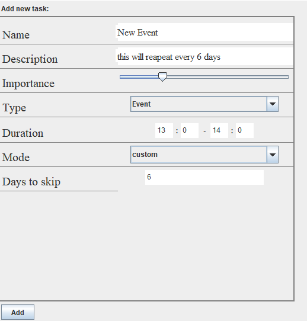
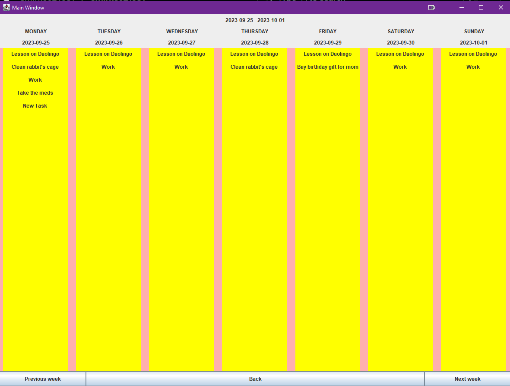
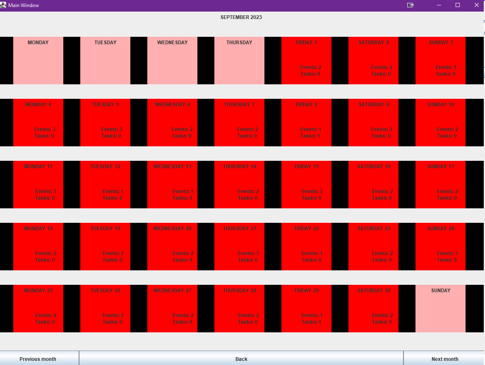
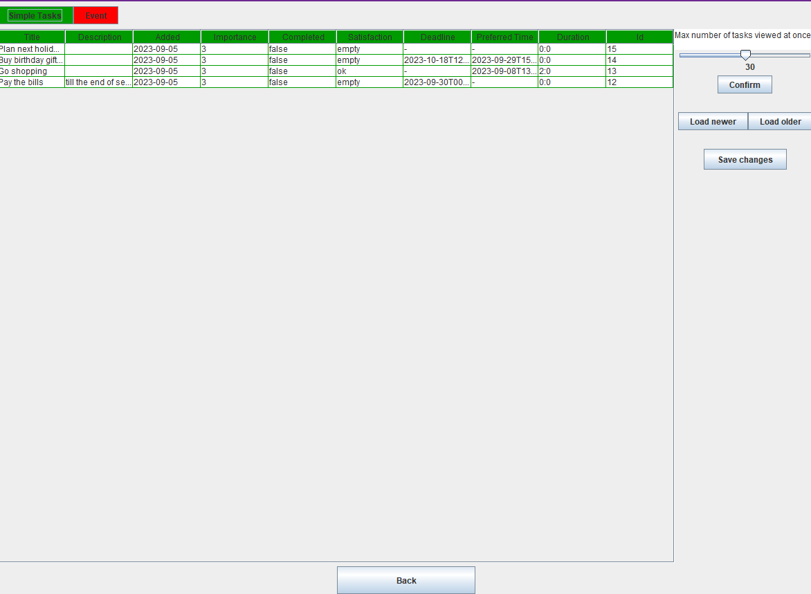
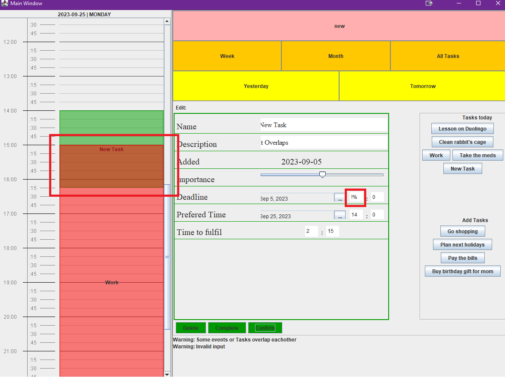

<h1>Taski</h1>

Taski is a task manager application for a programming portfolio.

It allows the user to create different types of tasks and add them to a calendar. The two types of tasks the app currently enables are Simple Task and Event. 

Simple Task is a one-time task. The user can schedule it for a specific day, set just a deadline and add it to the calendar later, or just save it without any time limitation and add it to the schedule when it's convenient.

Event can be a recurring task. The available repeating patterns are: daily, on specified days of the week, specified days of the month (eg. on the 1st, 5th, and 18th day of each month), and each x of days.

The user can use three views: day- the default view, week, and month.

The user can choose a day in the week or month view to jump to.

The user can see all tasks, edit their titles and descriptions directly in the table, or edit the rest after being redirected to this task in a day view. The user can set the maximum amount of records that are loaded from the database and displayed at once

The user can also access the task's edit mode by clicking it on the timeline or picking it from the panel on the right.

When tasks overlap each other or then the user inputs invalid data, a warning will be displayed.

<h3>Technologies used</h3>
<ul>
<li>Programming language Java 8</li>
<li>Database: SQLite</li>
</ul>
<h3>Third-Party Libraries</h3>

JDatePicker by <a href="https://github.com/JDatePicker/JDatePicker">JUAN HEYNS</a> on BSD license

<h3>Structure</h3>

Tasks and days are represented by classes. Their fields are modified by the user with the graphic interface. When the user performs an action, modifications to the fields of the classes and modifications to the records in the database are done independently if they are necessary. The database is accessed manually by the class CRUD, supported by the class Utilities. The class DatabaseBridge converts task models to data accepted by the CRUD methods and creates task models based on data retrieved from the database.

Requirements: The application runs on Windows with Java version 8 minimum.

